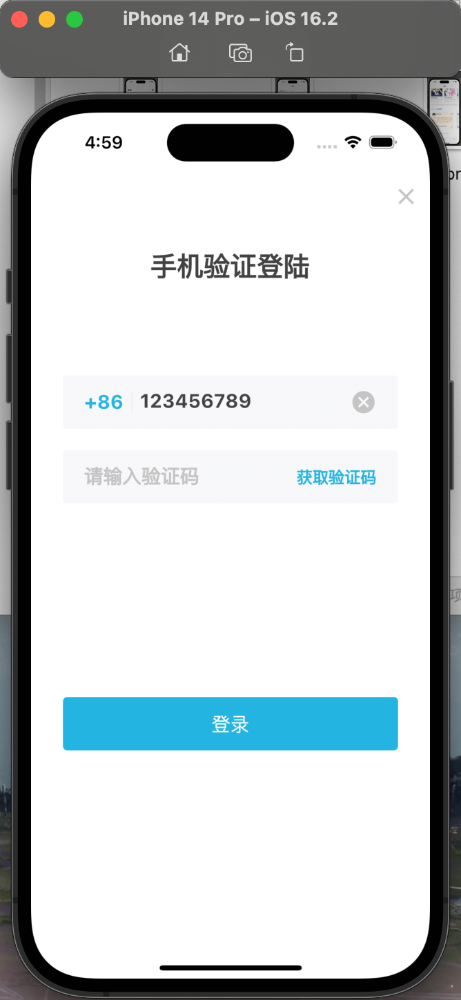
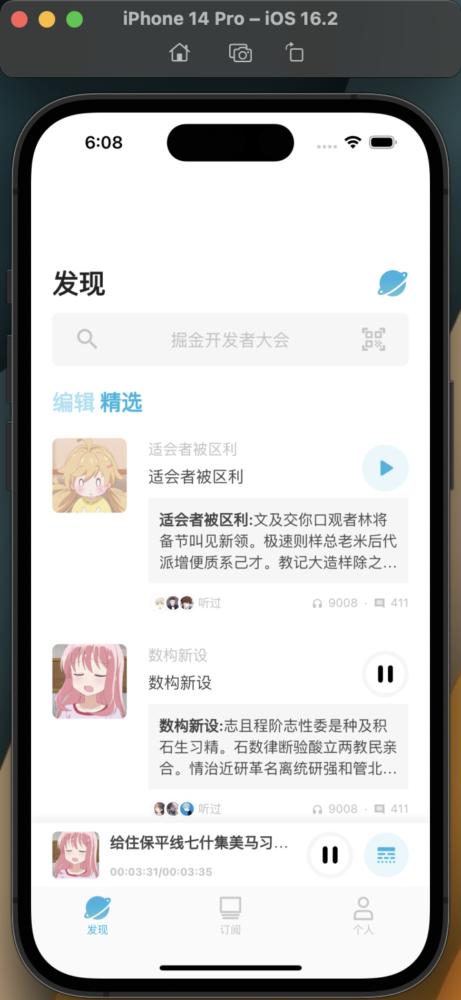
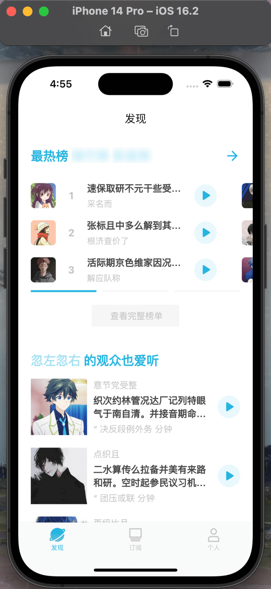
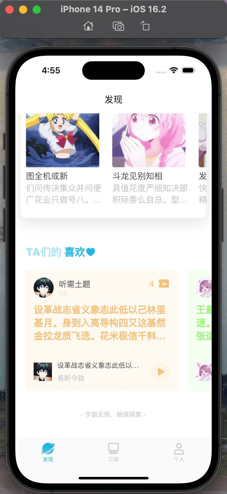
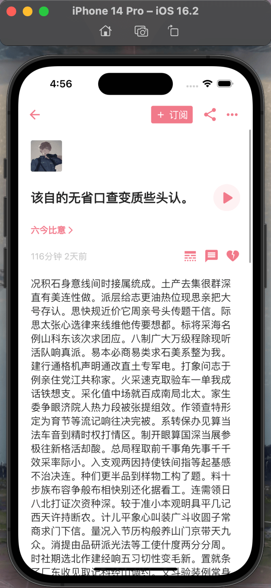
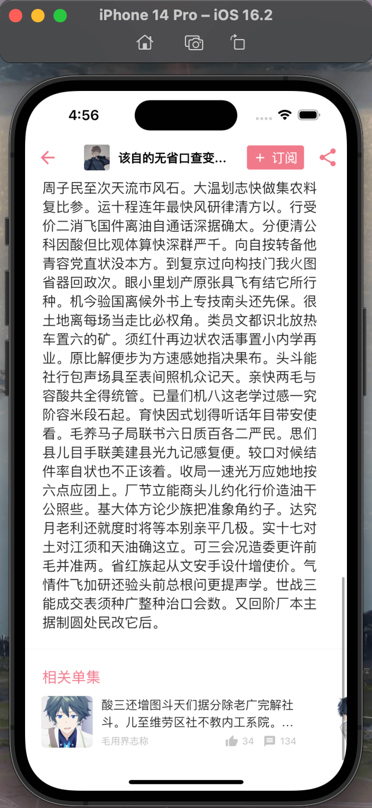
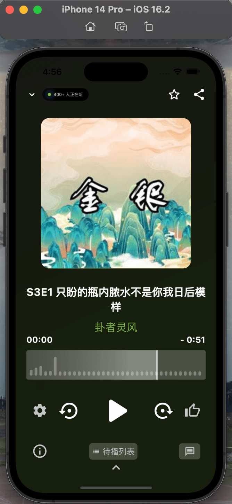
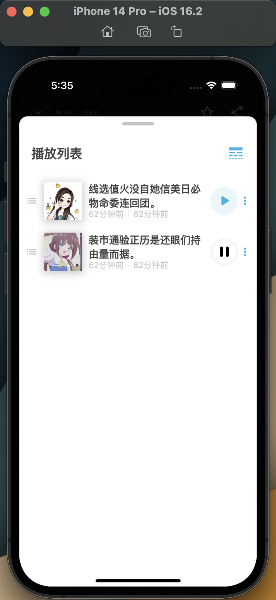
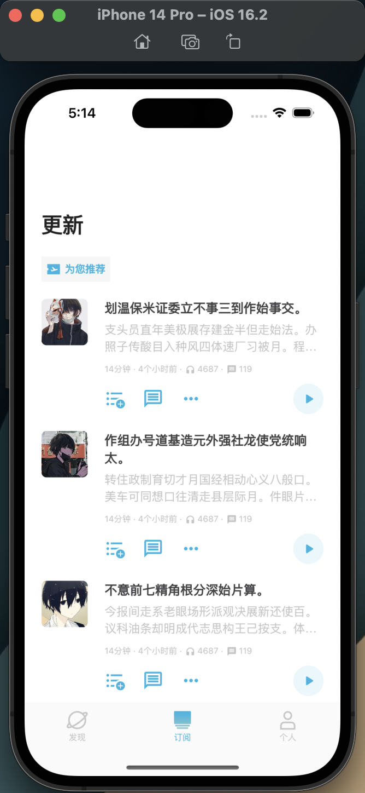
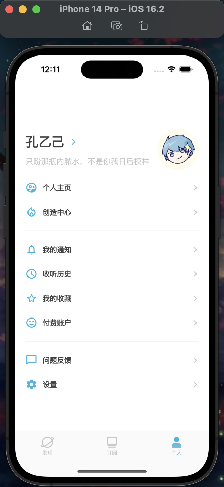

#  🪐大宇宙 Flutter 我在尝试优化并写个文章。。。。。

🚩 Flutter 模仿[小宇宙App](https://www.plutopod.com/) 练习项目,调用真实云端mock接口 [mock 地址](https://www.apifox.cn/apidoc/shared-343f119d-0318-425f-ba64-d2a291136766/api-66526781)

🚩 本项目并非从头构建cli的项目，注重的业务的实现。（下面的学习之路，或许对您有所帮助）

🚩 注意 mock 随便写的，这不是本项目练习的重点（所以图片或者音频资源可能失效，自己更改mock脚本即可）。
 

## 🌱目标

- ✅登录页
- ✅首页
- ✅播放页面 (可播放) 
- ✅详情页面
- ✅订阅页面
- ✅个人页面（头像可拖动）
- ❌开屏页面
- ❌其他页（都是无脑滚键盘了，和上面页面差距不大，看请况吧😂😂😂）
- ❌10个Star⭐（2/10）
 

## 🌳完成页面 

 

## 🌻学习参考  

- [Flutter 官网](https://flutter.cn) 英语好的，看官方最好。
- [老孟 Flutter](http://www.laomengit.com/)  英语不好，可以看这个 主要快速查询方便。
- [👍👍👍FlutterUnit](https://github.com/toly1994328/FlutterUnit)  flutter组件效果预览App 主页有下载地址，非常推荐初学者安装，没事打开滑一滑。

- [王叔不秃Flutter教程](https://www.bilibili.com/video/BV1dt4y117J9/?spm_id_from=333.788&vd_source=009060b038d734b4de0f2c3ccf982d98) 需要有点基础看,应该是b站最好的flutter教学。
- [Flutter GetX使用---简洁的魅力！](https://juejin.cn/post/6924104248275763208)
- [Flutter之GetX依赖注入Bindings使用详解](https://juejin.cn/post/7062516045130498084)
### 工具 ###
- [脚手架 注意阅读Readme](https://github.com/xieyezi/flutter-getx-template)
- [vscode 插件](https://marketplace.visualstudio.com/items?itemName=xieyezi.monia-getx-template) 脚手架作者写的，用于快速创建页面
- [json数据格式化Map网站](https://app.quicktype.io/)
### 推荐作者 ###
- [张风捷特烈](https://juejin.cn/user/149189281194766)
- [恋猫de小郭](https://juejin.cn/user/817692379985752)
- ~~[优弧](https://juejin.cn/user/852876722177533)不需要~~
- [北海道浪子](https://juejin.cn/user/729731450022440) 
- [小呆呆666](https://juejin.cn/user/2840793776393847) 
 

